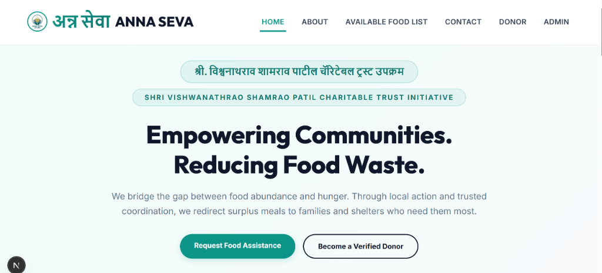
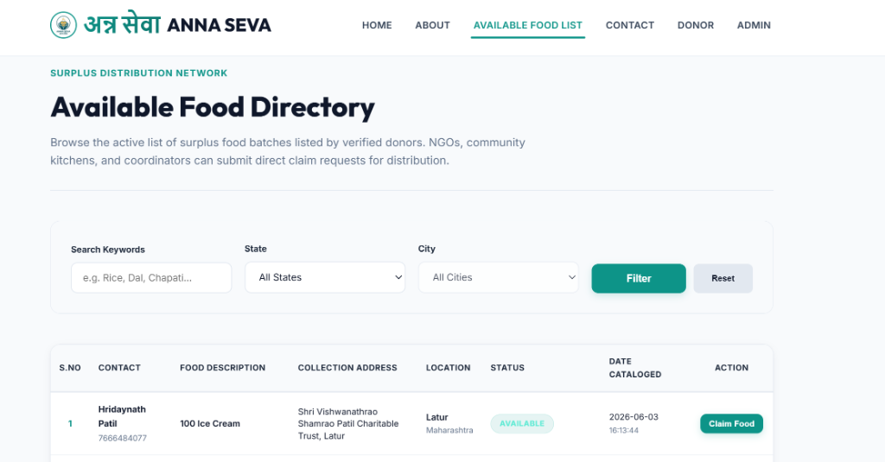
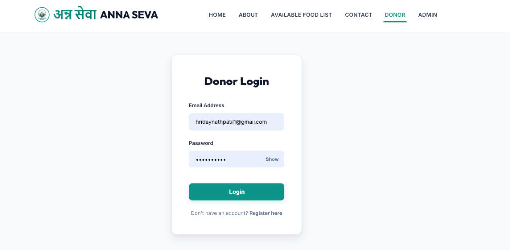
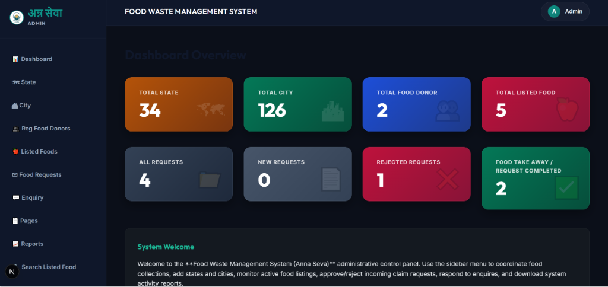
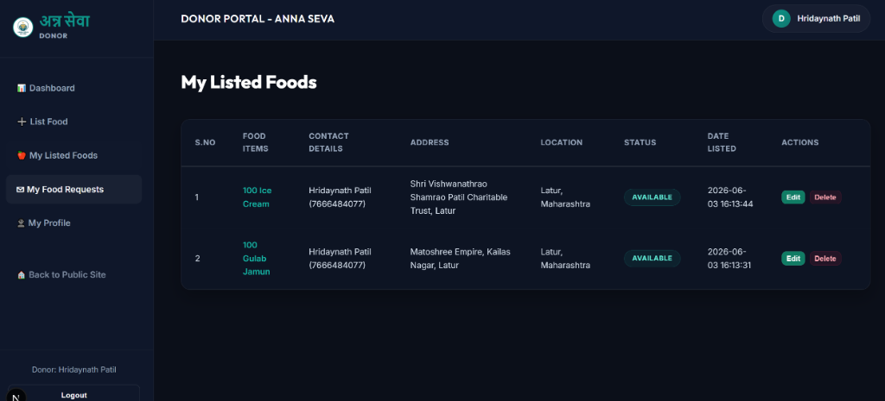

# 🌾 अन्न सेवा (Anna Seva) - Feed Needy, Reduce Waste

An elegantly designed, full-stack food rescue, redistribution, and donation web application. Operated under the patronage of the **Shri Vishwanathrao Shamrao Patil Charitable Trust**, Anna Seva connects verified donors (banquets, caterers, restaurants, and households) with local recipient organizations (NGOs, shelter homes, and volunteers) to direct surplus food batches to those who need them most.

🔗 **Live Deployment:** [https://anna-seva.onrender.com/](https://anna-seva.onrender.com/)

---

### 📸 Application Screenshots

| **Landing Page** | **Available Food Directory** |
|:---:|:---:|
|  |  |

| **Donor Portal Login** | **Admin Dashboard** |
|:---:|:---:|
|  |  |

| **Donor Food Listings** |
|:---:|
|  |

---

## 🚀 Key Features

### 1. Immersive Public Landing Page
* **Light-Gradient Hero Interface:** A premium, light-themed landing experience featuring stacked Devanagari and English trust initiative badges, modern typography, and a centered call-to-action layout.
* **Commitment to Social Welfare:** A checkmark-bulleted breakdown introducing visitors to our coordinated rescue network, local alliances, wide-reaching distribution, and direct transparency model.
* **Live Impact Stats Dashboard:** Real-time database metrics counting active donors, listed food batches, and completed deliveries.
* **Three Operational Pillars:** Structured direction modules showing how Donors list food, Requesters browse & claim, and Admins audit regional distribution.

### 2. User Authentication & Donor Approvals
* **Secure Registration:** Responsive onboarding screens for new food donors.
* **Admin Approval Verification Flow:** All newly registered donors default to a `pending` state and cannot log in until approved. Upon registration, they are shown a guidelines page explaining their request has been sent to the admin.
* **Password Visibility Toggle:** Interactive fields equipped with inline toggles to show/hide input passwords securely.
* **State & City Hierarchical Menus:** Registration prompts are mapped to state-specific city lists dynamically queried from the database.

### 3. Public Available Food Directory
* **Search & Filters:** Integrated filter panel letting NGOs and coordinators query available food batches by keywords, state, and city.
* **Sleek Table Layout:** A compact, responsive layout displaying contact details (name & phone number stacked), food items, address, city/state, status badges, and date cataloged.
* **Allocation Request Modal:** Clicking "Claim Food" triggers an interactive modal containing food summaries and a form to submit claims (NGO name, mobile, address, justification, and quantity).

### 4. Donor Management Panel
* **Impact Dashboard:** Overview tracking listed food batches, active claims, and completed fulfillments.
* **Food Listing Form:** Inputs to catalog surplus food details (contact person, phone number, food description, collection address, state, and city).
* **Listing Logs:** View listed items, edit details of existing available items, and track claimed/completed statuses.
* **Claim Request Logs:** Check incoming recipient requests for their listed food batches, including NGO names, reasons, and target quantities. 
* **Profile Management:** View profile summary with a read-only field lock on mobile and email to preserve identity checks.

### 5. Secure Razorpay Donations
* **Seamless Payment Flow:** Integrated donation system supporting custom and preset donation amounts (₹500, ₹1,000, ₹2,100, etc.).
* **Section 80G Tax Benefit:** Supports generating donation receipts and tax exemption details under Section 80G (URN: `ABMTS3026RF20251`) of the Income-tax Act, 1961.
* **Offline Payments:** Supports direct bank transfers and PhonePe QR code scan simulation.

### 6. Administration Control Panel
* **Admin Dashboard:** High-level metrics tracking trust performance: total donors, cataloged meals, enquiries, and completed claims.
* **Donor Verification Directory:** View register requests with badges (`pending`, `approved`, `rejected`) and perform direct Approve, Reject, or Remove actions.
* **Food Listings Auditor:** Review, verify, and delete cataloged food items.
* **Allocation Requests Auditor:** Track recipient request logs, inspect NGO justifications, and audit distribution pipelines.
* **Location Database Manager:** Admin panels to add and delete states and cities dynamically.
* **Static Content Management:** Editor page to update trust descriptions and helpline info rendered in the Public About and Contact pages.

---

## 🛠️ Tech Stack & Architecture

### Core Frontend & Compiler
* **Framework:** **Next.js 16.2.7** (built on React 19) utilizing the modern **App Router** paradigm.
* **Development Server:** **Next.js Turbopack** for lightning-fast compilation, hot module replacement (HMR), and rapid rendering.
* **Styling:** **Vanilla CSS** styled in `src/app/globals.css`. Uses an HSL-tailored harmonious corporate palette centered on **Slate Navy** and **Mint Teal** with premium micro-animations and smooth transitions.

### Backend & API Router
* **Architecture:** Next.js App Router **REST API endpoints** for all backend workflows (authentication, locations, listings, requests, enquiries, and payments).

### Database Engine (Dual Support with Fallback)
The application dynamically adapts to its environment using a robust dual-database layer with automatic fallback:
* **Production Database (PostgreSQL/Supabase):**
  * Communicates via **`pg` (v8.21.0)** connection pooling.
  * Includes a built-in **DNS Resolution Fallback** wrapper that resolves Supabase hostname addresses to IPv4 first, preventing `ENETUNREACH` connection errors in hosting environments with partial IPv6 support (e.g., Render).
  * Automatically translates standard SQLite-based parameterized queries (`?`) into PostgreSQL-compatible placeholders (`$1`, `$2`) dynamically, allowing codebase compatibility across both systems.
* **Development / Local Fallback (SQLite):**
  * Leverages native Node.js **`node:sqlite`** (`DatabaseSync`) requiring zero external dependencies.
  * Configured with **Write-Ahead Logging (WAL)** (`PRAGMA journal_mode = WAL;`) for high concurrency.
  * Equipped with a **Busy Timeout** (`PRAGMA busy_timeout = 10000;`) of 10 seconds to avoid database lock exceptions during parallel compilation and rendering workers.

### Payment Integration
* **Razorpay Webhooks & REST API:** Uses standard `fetch` queries mapped directly to the official Razorpay API, avoiding the overhead of heavy third-party SDK dependencies.

---

## ⚙️ Getting Started

### Prerequisites
* **Node.js:** Version `22.x` or later (required for native `node:sqlite` support).

### 1. Environment Configuration
Create a `.env.local` file in the root directory and configure the following variables:
```env
# Database Configuration (Optional: Omitting this falls back to local SQLite)
DATABASE_URL="your-postgresql-connection-string"

# Razorpay Keys (Optional: Omitting this enables mock/development donation mode)
RAZORPAY_KEY_ID="your-razorpay-key-id"
RAZORPAY_KEY_SECRET="your-razorpay-key-secret"
```

### 2. Install Dependencies
```bash
npm install
```

### 3. Run Development Server
```bash
npm run dev
```
Open [http://localhost:3000](http://localhost:3000) to view the application in the browser.

### 4. Build for Production
```bash
npm run build
npm run start
```

---

## ☁️ Deployment

### Render Blueprint
This repository is configured with a `render.yaml` template for quick deployment. In SQLite fallback mode, a 1GB persistent disk (`anna-seva-db`) is mounted at `/opt/render/project/src/data` to ensure local SQLite files persist across deployments.

Happy redistributing! Reduce waste, feed lives.
